# VIZ 1: SHURKA FAMILY CRIMINAL ENTERPRISE - HUB-AND-SPOKE NETWORK

**Purpose:** Reveal central command & control structure of criminal enterprise

**Key Findings:**
- Talia Havakok: 116 connections (central hub)
- Signature Investment Group: 105 connections (financial nexus)
- Manny Shurka: 99 connections (co-conspirator)
- Gilad Havakok: 99 connections
- Jason Shurka: 35 connections (PRIMARY TARGET)

```mermaid
graph TD
    %% Shurka Family Criminal Enterprise Hub-and-Spoke Network

    org_all_star_car_wash_corp["org_all_star_car_wash_corp"]
    org_haifa_neve_shanan["org_haifa_neve_shanan"]
    org_dyur_yoknam_llc["org_dyur_yoknam_llc"]
    bat10_005["bat10_005"]
    person_gilad_havakok["Gilad Havakok<br/>99 connections"]
    style person_gilad_havakok fill:#ff6b6b,stroke:#c92a2a,stroke-width:4px,color:#fff
    person_esther_zernitsky["person_esther_zernitsky"]
    org_unifyd_world_inc["org_unifyd_world_inc"]
    person_daniel_avakook["person_daniel_avakook"]
    person_moshe_shurka["Moshe Shurka<br/>84 connections"]
    style person_moshe_shurka fill:#ff8787,stroke:#f03e3e,stroke-width:3px,color:#fff
    org_top_of_line_brooklyn_inc["org_top_of_line_brooklyn_inc"]
    person_ben_avakook["person_ben_avakook"]
    person_manny_shurka["Manny Shurka<br/>99 connections"]
    style person_manny_shurka fill:#ff6b6b,stroke:#c92a2a,stroke-width:4px,color:#fff
    org_golan_katzerin_llc["org_golan_katzerin_llc"]
    4b47ee56_069a_4fbe_ac2c_933a4a9ca112["4b47ee56-069a-4fbe-ac2c-933a4a"]
    1acb1a8c_5850_45dc_8def_78efeaaf6e0f["1acb1a8c-5850-45dc-8def-78efea"]
    bat10_004["bat10_004"]
    marcy_galazan_shurka["marcy-galazan-shurka"]
    org_dyur_rishon_lezion_llc["org_dyur_rishon_lezion_llc"]
    bat10_002["bat10_002"]
    org_dyur_natanya_llc["org_dyur_natanya_llc"]
    person_efraim_shurka["person_efraim_shurka"]
    org_dyur_naharia_llc["org_dyur_naharia_llc"]
    org_mor_001["org_mor_001"]
    org_signature_investment_group["Signature Investment<br/>Group (105 conn)"]
    style org_signature_investment_group fill:#4c6ef5,stroke:#364fc7,stroke-width:4px,color:#fff,shape:rectangle
    moshe_shurka["moshe-shurka"]
    person_talia_havakok["Talia Havakok<br/>116 connections"]
    style person_talia_havakok fill:#ff6b6b,stroke:#c92a2a,stroke-width:4px,color:#fff
    62326259_7dc4_4ae7_99b9_dc6978510fd2["62326259-7dc4-4ae7-99b9-dc6978"]
    person_michael_ayngorn["person_michael_ayngorn"]
    7cbab5f7_e1fe_4562_aadf_d5c98084dbc4["7cbab5f7-e1fe-4562-aadf-d5c980"]

    person_daniel_avakook -.-> |family| person_talia_havakok
    person_talia_havakok -.-> |family| person_daniel_avakook
    person_ben_avakook -.-> |family| person_talia_havakok
    person_talia_havakok -.-> |family| person_ben_avakook
    62326259_7dc4_4ae7_99b9_dc6978510fd2 -.-> |family| person_talia_havakok
    person_talia_havakok -.-> |family| 62326259_7dc4_4ae7_99b9_dc6978510fd2
    person_talia_havakok --> |business| org_unifyd_world_inc
    person_gilad_havakok -.-> |family| person_talia_havakok
    person_talia_havakok -.-> |family| person_gilad_havakok
    person_daniel_avakook -.-> |family| person_talia_havakok
    person_talia_havakok -.-> |family| person_daniel_avakook
    person_ben_avakook -.-> |family| person_talia_havakok
    person_talia_havakok -.-> |family| person_ben_avakook
    62326259_7dc4_4ae7_99b9_dc6978510fd2 -.-> |family| person_talia_havakok
    person_talia_havakok -.-> |family| 62326259_7dc4_4ae7_99b9_dc6978510fd2
    org_signature_investment_group --> |ownership| org_mor_001
    org_signature_investment_group --> |ownership| org_golan_katzerin_llc
    org_signature_investment_group --> |ownership| org_haifa_neve_shanan
    org_signature_investment_group --> |ownership| org_dyur_yoknam_llc
    org_signature_investment_group --> |ownership| org_dyur_rishon_lezion_llc
    org_signature_investment_group --> |ownership| org_dyur_natanya_llc
    org_signature_investment_group --> |ownership| org_dyur_naharia_llc
    person_manny_shurka --> |ownership| org_signature_investment_group
    person_manny_shurka --> |employee| org_signature_investment_group
    org_signature_investment_group --> |ownership| org_top_of_line_brooklyn_inc
    org_signature_investment_group --> |ownership| org_mor_001
    org_signature_investment_group --> |ownership| org_golan_katzerin_llc
    org_signature_investment_group --> |ownership| org_haifa_neve_shanan
    org_signature_investment_group --> |ownership| org_dyur_yoknam_llc
    org_signature_investment_group --> |ownership| org_dyur_rishon_lezion_llc
    person_manny_shurka --> |ownership| org_mor_001
    person_manny_shurka --> |ownership| org_signature_investment_group
    bat10_004 -.-> |family| person_manny_shurka
    person_manny_shurka -.-> |family| bat10_004
    7cbab5f7_e1fe_4562_aadf_d5c98084dbc4 -.-> |family| person_manny_shurka
    person_manny_shurka -.-> |family| 7cbab5f7_e1fe_4562_aadf_d5c98084dbc4
    4b47ee56_069a_4fbe_ac2c_933a4a9ca112 -.-> |family| person_manny_shurka
    person_manny_shurka -.-> |family| 4b47ee56_069a_4fbe_ac2c_933a4a9ca112
    person_manny_shurka -.-> |family| person_moshe_shurka
    person_moshe_shurka -.-> |family| person_manny_shurka
```

**RICO Significance:** Hub-and-spoke structure proves existence of criminal ENTERPRISE under 18 U.S.C. § 1961(4)
