# VIZ 2: RICO TIMELINE WITH PREDICATE ACTS (1997-2025)

**Purpose:** Establish pattern of racketeering activity over 28-year period

**Key Milestones:**
- 1997: Jason Shurka born
- 2002: Jan 18 - Creditor-Proof Agreement (SMOKING GUN)
- 2012-2013: Major activity spike (32 documented events)
- 2024 Aug: $30M/$15M extortion coordination
- 2024 Nov 14: WAR CALL (Hobbs Act violation)
- 2025: Investigation climax (20 active events)

```mermaid
timeline
    title Shurka Criminal Enterprise Timeline: RICO Predicate Acts (1997-2025)
    section 1995-1999
        1997 : 🎯 Jason Shurka born
        1998 : 2 documented events
    section 2000-2004
        2001 : 2 documented events
        2002 : ⚖️ Creditor-Proof Agreement (SMOKING GUN)
        2003 : 2 documented events
    section 2005-2009
        2005 : 1 documented events
    section 2010-2014
        2012 : 📈 Major activity spike (20 events)
        2013 : 12 documented events
    section 2015-2019
        2016 : 2 documented events
        2017 : 2 documented events
        2019 : 2 documented events
    section 2020-2024
        2021 : 2 documented events
        2022 : 1 documented events
        2023 : 2 documented events
        2024 : 🚨 Aug: $30M/$15M extortion<br/>Nov 14: WAR CALL
    section 2025-2029
        2025 : ⚖️ Investigation peak (20 events)
```

**RICO Significance:** Demonstrates PATTERN of racketeering activity (2+ predicate acts within 10 years)
