# VIZ 3: SIGNATURE INVESTMENT GROUP - OWNERSHIP/CONTROL STRUCTURE

**Purpose:** Expose shell company layering and asset concealment

**Key Findings:**
- Total SIG connections: 105
- Ownership relationships: 104
- Owner entities: 15
- Controlled entities: 9

```mermaid
graph TB
    %% Signature Investment Group - Ownership & Control Structure

    SIG["🏢 SIGNATURE INVESTMENT GROUP<br/>105 Total Connections"]
    style SIG fill:#4c6ef5,stroke:#364fc7,stroke-width:5px,color:#fff,font-size:16px

    subgraph OWNERS["👥 OWNERS/CONTROLLERS"]
        person_manny_shurka["person_manny_shurka<br/>(11 connections)"]
        person_manny_shurka --> SIG
        org_dyk_001["org_dyk_001<br/>(1 connections)"]
        org_dyk_001 --> SIG
        org_gk_001["org_gk_001<br/>(1 connections)"]
        org_gk_001 --> SIG
        org_mor_001["org_mor_001<br/>(1 connections)"]
        org_mor_001 --> SIG
        org_hns_001["org_hns_001<br/>(1 connections)"]
        org_hns_001 --> SIG
        org_dna_001["org_dna_001<br/>(1 connections)"]
        org_dna_001 --> SIG
        org_drl_001["org_drl_001<br/>(1 connections)"]
        org_drl_001 --> SIG
        org_dnt_001["org_dnt_001<br/>(1 connections)"]
        org_dnt_001 --> SIG
        org_golan_katzerin["org_golan_katzerin<br/>(1 connections)"]
        org_golan_katzerin --> SIG
        org_dyur_natanya["org_dyur_natanya<br/>(1 connections)"]
        org_dyur_natanya --> SIG
    end

    subgraph OWNED["🏛️ CONTROLLED ENTITIES"]
        O_org_mor_001["org_mor_001"]
        SIG --> O_org_mor_001
        O_org_golan_katzerin_llc["org_golan_katzerin_llc"]
        SIG --> O_org_golan_katzerin_llc
        O_org_haifa_neve_shanan["org_haifa_neve_shanan"]
        SIG --> O_org_haifa_neve_shanan
        O_org_dyur_yoknam_llc["org_dyur_yoknam_llc"]
        SIG --> O_org_dyur_yoknam_llc
        O_org_dyur_rishon_lezion_llc["org_dyur_rishon_lezion_llc"]
        SIG --> O_org_dyur_rishon_lezion_llc
        O_org_dyur_natanya_llc["org_dyur_natanya_llc"]
        SIG --> O_org_dyur_natanya_llc
        O_org_dyur_naharia_llc["org_dyur_naharia_llc"]
        SIG --> O_org_dyur_naharia_llc
        O_46ebf982_0eb6_4604_b64f_1134bf648f9e["46ebf982-0eb6-4604-b64f-1134bf"]
        SIG --> O_46ebf982_0eb6_4604_b64f_1134bf648f9e
        O_org_top_of_line_brooklyn_inc["org_top_of_line_brooklyn_inc"]
        SIG --> O_org_top_of_line_brooklyn_inc
    end
```

**RICO Significance:** Complex corporate structure designed to conceal ownership and obstruct judgment collection
