# VIZ 5: GEOGRAPHIC/JURISDICTIONAL NEXUS MAP

**Purpose:** Establish multi-jurisdictional criminal enterprise for RICO

**Key Findings:**
- **Israel**: 47 entities (primary type: organization)
- **Brooklyn, NY**: 42 entities (primary type: PERSON)
- **Florida**: 9 entities (primary type: person)
- **New York**: 5 entities (primary type: LLC)
- **Queens, NY**: 1 entities (primary type: organization)
- **Unknown**: 1 entities (primary type: CORPORATION)
- **New York, NY**: 1 entities (primary type: LOCATION)

```mermaid
graph LR
    %% Shurka Criminal Enterprise - Geographic/Jurisdictional Nexus

    US["🇺🇸 UNITED STATES"]
    style US fill:#1e3a8a,stroke:#1e40af,stroke-width:3px,color:#fff

    IL["🇮🇱 ISRAEL"]
    style IL fill:#0c4a6e,stroke:#0369a1,stroke-width:3px,color:#fff

    Brooklyn_NY["Brooklyn, NY<br/>42 entities"]
    US --> Brooklyn_NY
    Queens_NY["Queens, NY<br/>1 entities"]
    US --> Queens_NY
    Florida["Florida<br/>9 entities"]
    US --> Florida
    New_York["New York<br/>5 entities"]
    US --> New_York
    Israel["Israel<br/>47 entities"]
    IL --> Israel

    %% Cross-border connections
    US <==> |Wire fraud<br/>Money laundering| IL
```

**RICO Significance:** Multi-state and international operations support RICO enterprise scope and wire fraud predicates (18 U.S.C. § 1343)
