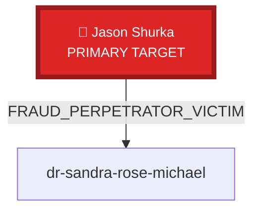

# VIZ 6: CRIMINAL CONSPIRACY COORDINATION NETWORK

**Purpose:** Map Manny ↔ Jason conspiracy coordination and co-conspirator network

**Key Evidence:**
- **Aug 2024**: Jason $30M extortion demand → Manny $15M 'lowball' offer (coordination)
- **Nov 14, 2024**: Jason ultimatum call → Hours later, coordinated multi-platform attack
- **Pattern**: Shared extortion methodology, synchronized timing, unified fraud scheme

**Conspiracy-Related Relationships Identified:** 2

## Conspiracy Relationships Detail:

1. ** ↔ **
   - Type: CRIMINAL_CONSPIRACY
   - RICO: Pattern of racketeering: extortion, wire fraud, coordinated intimidation. Manny's slip about 'Jason's organization' exposes TLS fraud....

2. **jason-yosef-shurka ↔ dr-sandra-rose-michael**
   - Type: FRAUD_PERPETRATOR_VICTIM
   - Timeline: March 2022 - ongoing...

**RICO Significance:** Establishes CONSPIRACY (18 U.S.C. § 371) and demonstrates coordinated racketeering pattern
