# VIZ 6: CRIMINAL CONSPIRACY COORDINATION NETWORK

**Purpose:** Map Manny ↔ Jason conspiracy coordination and co-conspirator network

**Key Evidence:**
- **Aug 2024**: Jason $30M extortion demand → Manny $15M 'lowball' offer (coordination)
- **Nov 14, 2024**: Jason ultimatum call → Hours later, coordinated multi-platform attack
- **Pattern**: Shared extortion methodology, synchronized timing, unified fraud scheme

**Conspiracy-Related Relationships Identified:** 2

## Conspiracy Relationships Detail:

1. ** ↔ **
   - Type: CRIMINAL_CONSPIRACY
   - RICO: Pattern of racketeering: extortion, wire fraud, coordinated intimidation. Manny's slip about 'Jason's organization' exposes TLS fraud....

2. **jason-yosef-shurka ↔ dr-sandra-rose-michael**
   - Type: FRAUD_PERPETRATOR_VICTIM
   - Timeline: March 2022 - ongoing...

```mermaid
graph TD
    %% Criminal Conspiracy Coordination Network

    dr_sandra_rose_michael["dr-sandra-rose-michael"]
    jason_yosef_shurka["🎯 Jason Shurka<br/>PRIMARY TARGET"]
    style jason_yosef_shurka fill:#dc2626,stroke:#991b1b,stroke-width:5px,color:#fff,font-size:14px

    %% Conspiracy Relationships
    jason_yosef_shurka -->|FRAUD_PERPETRATOR_VICTIM| dr_sandra_rose_michael
```

**RICO Significance:** Establishes CONSPIRACY (18 U.S.C. § 371) and demonstrates coordinated racketeering pattern
